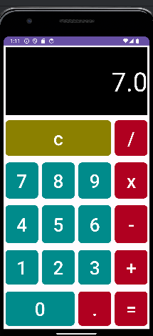
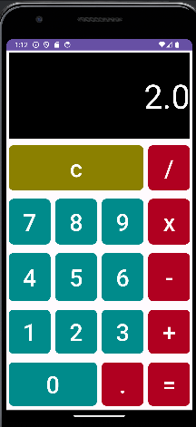
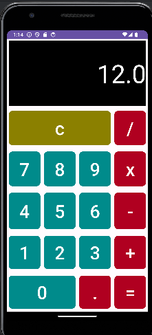
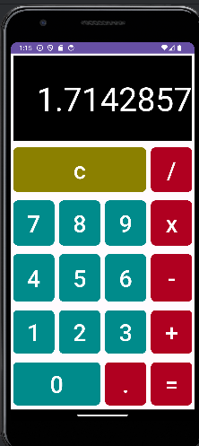
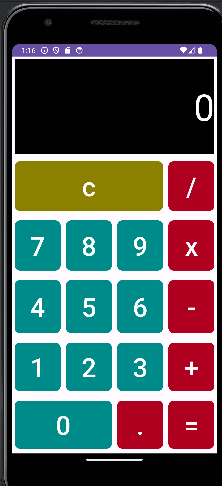
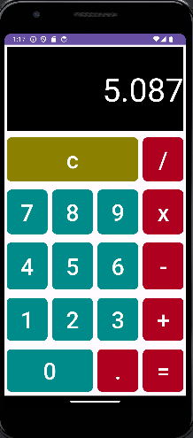

# Calculator - By Miquel
This Android calculator app provides basic arithmetic operations including addition, subtraction, multiplication, and division. It offers a simple and user-friendly interface for performing calculations on Android devices.

## Screenshots
- Addition
  
{:height="150px"}

- Subtraction
  
{:height="150px"}

- Multiplication
  
{:height="150px"}

- Division
  
{:height="150px"}

- Clear button to reset the calculation
  
{:height="150px"}

- Decimal support for floating-point numbers
  
{:height="150px"}

## Features

- Addition
- Subtraction
- Multiplication
- Division
- Clear button to reset the calculation
- Decimal support for floating-point numbers
  
## How to Use

1. Input numbers using the provided buttons.
2. Select the operation to perform.
3. Press the equals button to see the result.
4. Use the clear button to reset the calculation.

## Installation

You can install the app by either:
- [Downloading the APK](app-debug.apk) directly to your Android device and installing it.
- Cloning the repository and opening it in Android Studio. Run the app on an Android device or emulator.
